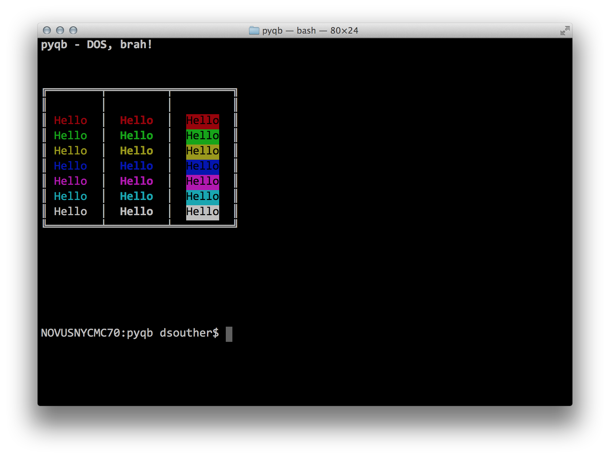

# pyqb

For when you need those sweet, sweet QuickBasic ANSI interfaces!

Exposes several low-level commands for building that sweet, sweet terminal art
you loved from the 80s, without the overhead and foolish limitations and
"architecture" imposed by (n)curses. Set your terminal to DOS (Latin 1) and
start printing those ╔╦╛ characters!

## Examples

Check ou the various scripts in here. Also, this screenshot:

Aww Yeah!

## Usage

Remember QuickBasic? Color? Locate? CLS? They're all here!

### `cls()`

Clear the terminal, and reset the cursor to `(0, 0)`.

### `write(string)`

Write some characters, with no following new line.

### `color(fg, bg = 0)`

Set the current terminal color. Background is optional, and defaults to black.
FG is between 0 and 15. BG is between 0 and 7.

| code | color  | code | color |
|------|--------|------|-------|
| 0    | black  | 8    | grey  |
| 1    | red    | 9    | light red |
| 2    | green  | 10   | light green |
| 3    | orange | 11   | light orange |
| 4    | blue   | 12   | light blue |
| 5    | purple | 13   | light purple |
| 6    | cyan   | 14   | light cyan |
| 7    | white  | 15   | bright white |

### `locate(row, col)`

Put the cursor at a certain position. The coordinate system starts from the
top-left corner at `(0, 0)`, and extends down per row with the first param and
right per character column with the second param. Terminals default to 24x80,
but resizing them will of course change the dimension.
